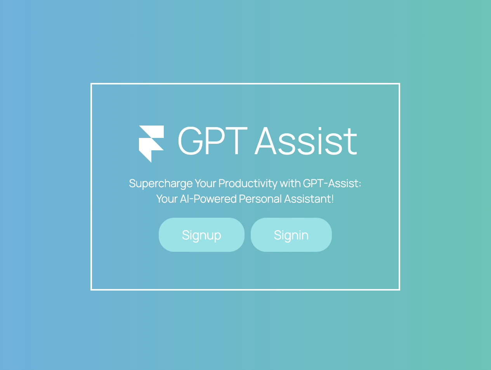

  
  <h1>GPT Assist</h1>
  
  

    Integrating the OpenAI API to Build A Powerful ChatBot and Virtual Assistant!
  

<!-- Badges -->

<!-- Table of Contents -->
# :notebook_with_decorative_cover: Table of Contents

- [About the Project](#star2-about-the-project)
- [Features](#computer-features)
  * [Dashboard](#dashboard)
  * [Prompt Library](#prompt-library)
  * [Custom Prompt Creation](#custom-prompt-creation)
  * [Chat Page](#chat-page)
  * [File Saving](#file-saving)
  * [Saved Projects](#saved-projects)
  * [User Account Information](#user-account-information)
  * [Pricing Plans](#pricing-plans)
  * [Signin and Signup](#signin-and-signup)
- [Tech Stack](#space_invader-tech-stack)
- [APIs Used](#gear-apis-used)
- [License](#scroll-license)
- [Contact](#telephone-contact)

<!-- About the Project -->
## :star2: About the Project

A MERN stack web application integrating the OpenAI API to create a robust chatbot. Enables users to connect to ChatGPT via API key and subscribe through the Stripe API for monthly or annual plans. Includes pre-built prompts for social media and content writing, with premium users gaining access to additional features like blog writing and email marketing. Utilizes MongoDB, Express.js, React.js, Node.js, Stripe Payment, and JWT Authentication for seamless functionality and enhanced user experience.

<!-- Feature Screenshots -->
## :computer: Features

### Dashboard

 
  

### Prompt Library

 
  

- Filter the prompts according to your requirements:

 
  

### Custom Prompt Creation

 
  

### Chat Page

 
  

### File Saving 

Save ChatGPT's response to your prompts into a file, which is then is organized into the projects section.
  

 
  

### Saved Projects

 
  

### User Account Information

 
  

### Pricing Plans

Gain access to even more pre-built prompts by choosing a premium paid subscription.

 
  

### Signin and Signup

 
  

 
  

<!-- TechStack -->
### :space_invader: Tech Stack

This project is built using the following technologies:

- Client
  * [![React][React.js]][React-url]
  * 
  * 

- Server
  * 
  * 
  * 
  * 
  * 
  
- Database
  * 
    
### :gear: APIs Used

- Stripe API: Manages subscriptions and user limits.
  
## :scroll: License

GPT Assist is licensed under the [MIT License](LICENSE).

## :telephone: Contact

For questions or suggestions, please reach out to me at [aminawasif20@gmail.com](mailto:aminawasif20@gmail.com).

---

<!-- MARKDOWN LINKS & IMAGES -->
<!-- https://www.markdownguide.org/basic-syntax/#reference-style-links -->
[React.js]: https://img.shields.io/badge/React-20232A?style=for-the-badge&logo=react&logoColor=61DAFB
[React-url]: https://reactjs.org/
